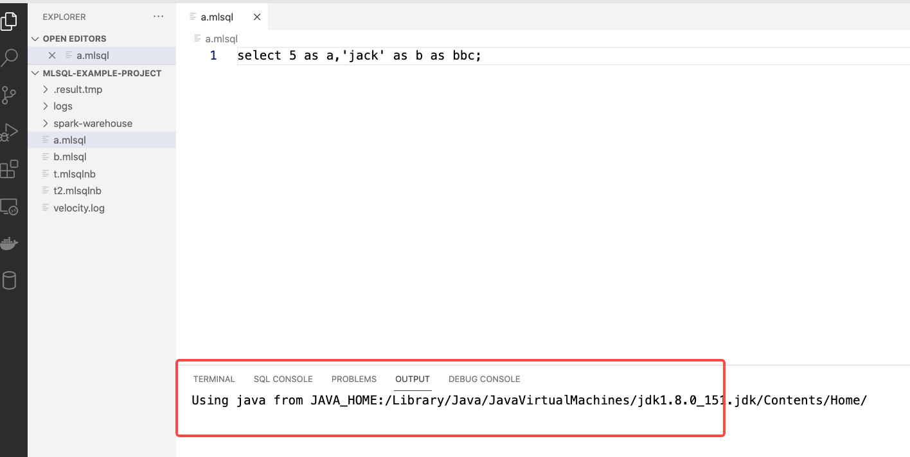
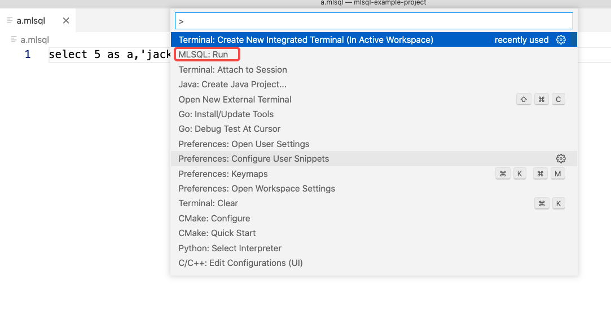
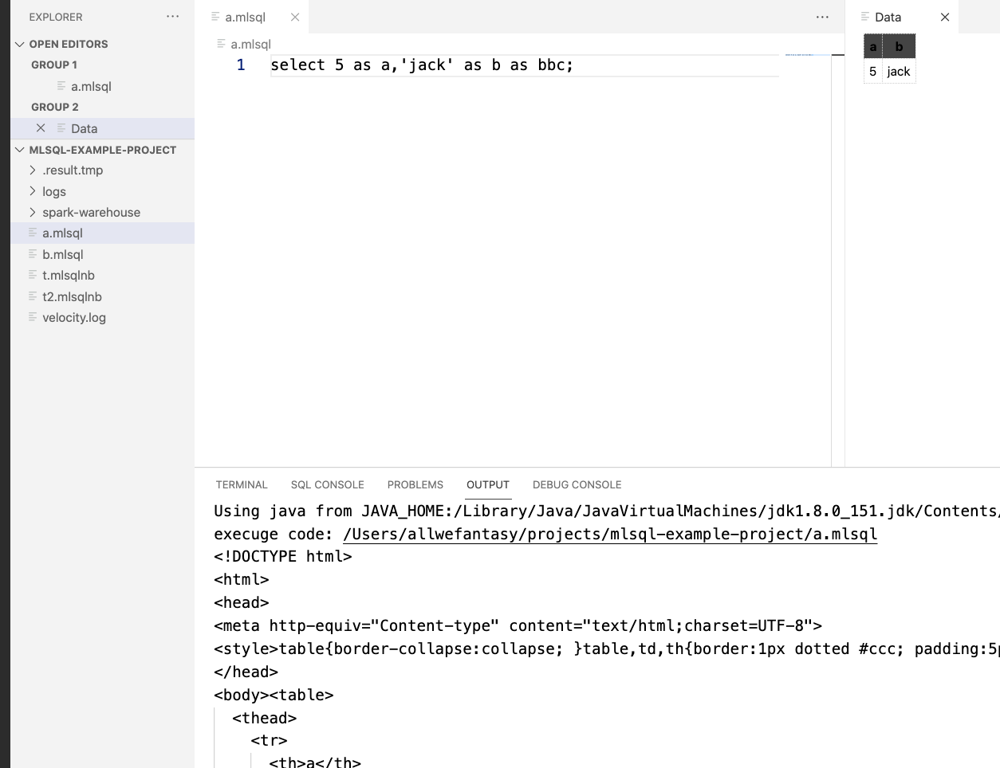
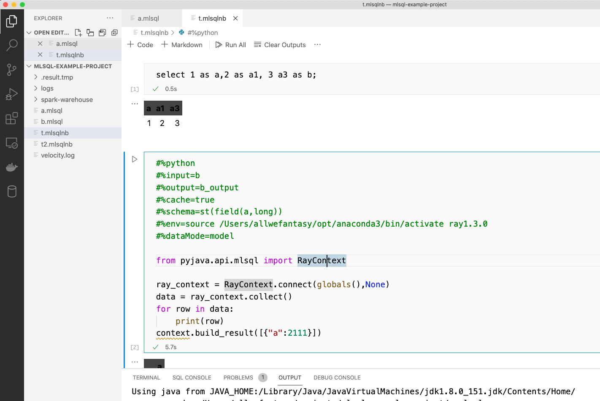
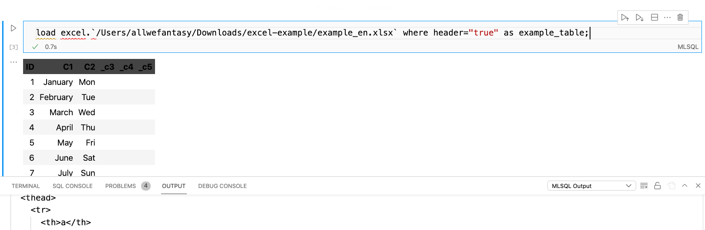
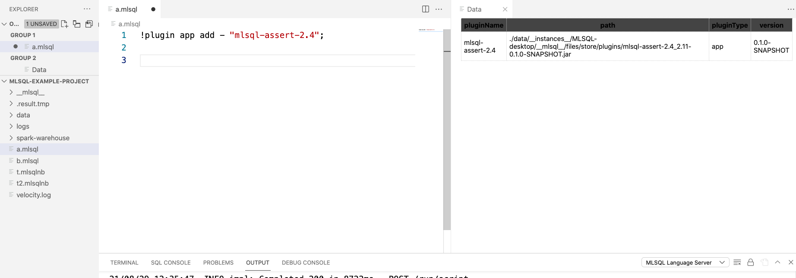
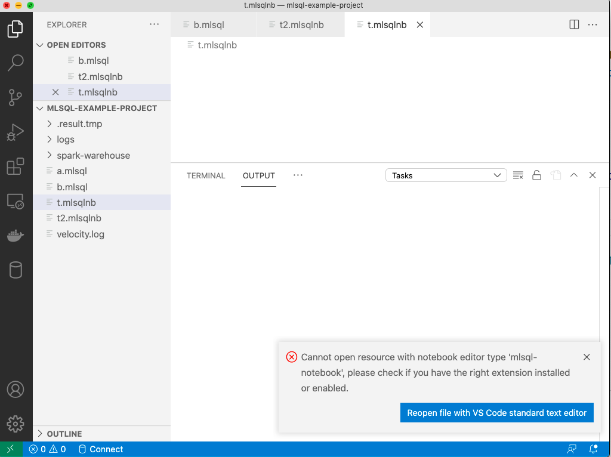

👉👉👉 This extension is still under development.

👉👉👉 JDK 1.8+ is required in your system.

# mlsql-Lang

mlsql-lang is A Visual Studio Code extension that allows you to run MLSQL code in both  Script/Notebook  interface.

### Current Version

v0.0.3

### v0.0.3 

* ✅ mlsql-lang highlight based on textmate
* ✅ Better table
* ✅ mlsql-lang code autocomplete

### v0.0.4 

* More control parameters on engine


## Requirements

1. JDK 1.8+ is required in your system.
2. mlsql-lang is only tested in MacOS/Linux though this extension works in Windows.

## Installation

### Install From Local

> this extension contains mlsql-lang already.

Download extension from `http://download.mlsql.tech/mlsql-0.0.3.vsix` 

   
   * run command `code --install-extension mlsql-0.0.3.vsix`
   * Or Just open `mlsql-0.0.3.vsix` in vscode.


### Install From Market

1. Search mlsql in market and install it.
2. Download mlsql-lang from `http://download.mlsql.tech/mlsql-lang.tar.gz` 
3. Extract mlsql-lang.tar.gz and configure the path by `engine.home` in `.mlsq.config`.

## Usage

1. Install extension.
2. Create a directory, then open it with Visual Studio Code.
3. File extensions `.mlsql` or `.mlsqlnb` are supported.
4. Once you open a mlsql file, the extension will be activated.



5. If not auto activate, click right left corner and click language select button, choose MLSQL.
7. Open command `MLSQL: run` to execute MLSQL script:

 
 

8. Here is notebook example:



## Congiguration (since 0.0.2)

You can configure MLSQL Lang server with file `.mlsql.config`  in your project (root path).

For example:

```
engine.home=...../mlsql-lang/mlsql-app_2.4-2.1.0-SNAPSHOT
engine.url=http://127.0.0.1:9003
engine.owner=admin
engine.memory=2048m

user.access_token=123
```


## Build-in Plugins

Excel/Shell is build-in support in this extention. You can load excel file like this:



## Install Third-party Plugin

The plugins repo: [mlsql-plugins](https://github.com/allwefantasy/mlsql-plugins)

You can install them like this:




## Know Issues

### .mlsqlnb have no plugin for it

If you reopen the project, when notebook is open before the mlsql-lang is activated,then 
the following error will happen:



Just close/open the notebook(.mlsqlnb) and everything goes Ok.

### mlsql lang server fails to quit when your workspace closed

Sometimes the lang server will not quit properly when you close your workspace.
Try using flowing command to find the pid and kill it.

```
ps -ef |grep 'tech.mlsql.plugins.langserver.launchers.stdio.Launcher'
```

